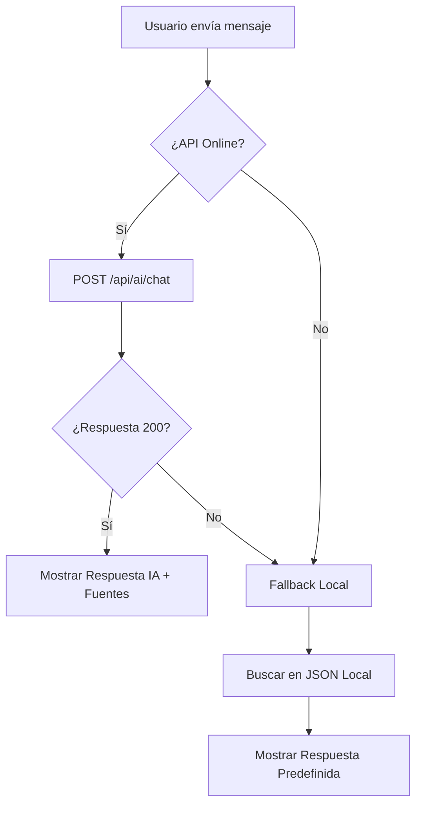

# Integración Frontend RAG

**Fecha:** 18 Dic 2025
**Estado:** Implementado

## Cambios Realizados

### 1. Backend (`api/index.js`)

Se ha añadido la ruta `POST /api/ai/chat` que actúa como puente hacia el servicio de RAG.

* **Input:** `{ message: string, history: array }`
* **Output:** `{ response: string, sources: array, usage: object }`
* **Manejo de Errores:** Devuelve 503 si el servicio de IA falla, permitiendo fallback en frontend.

### 2. Frontend (`public/js/chatbot.js`)

Se ha modernizado la función `processMessage` para priorizar la IA.

* **Fase 1 (AI):** Intenta contactar a `/api/ai/chat`. Si responde OK, renderiza la respuesta generada por GPT-4o-mini y cita las fuentes.
* **Fase 2 (Fallback):** Si la API falla (timeout, 500, o sin internet), recurre automáticamente a la base de conocimiento estática `KNOWLEDGE_DATABASE` (JSON local).
* **UX:** Se añadió formateo básico de Markdown (negritas, listas) para las respuestas de la IA.

## Diagrama de Flujo del Chat

